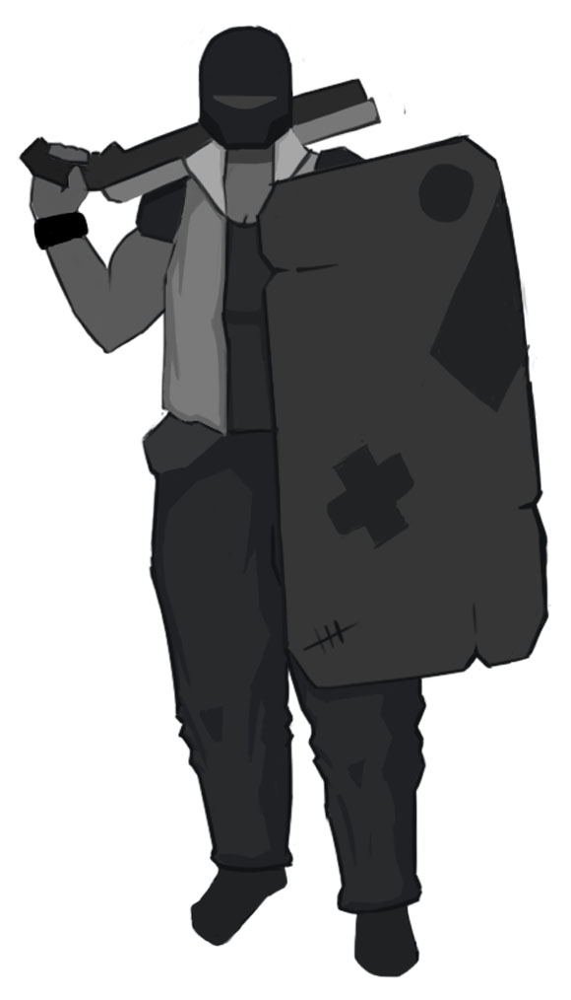

# ARIES

#### DESCRIPTION
A tanky bruiser that specializes in crowd crontrol and protecting her teammates.
Aries doesn't have a high damage output but can empower her teammates by protecting them with her shield and stunning opponents.

Stats                           | 
--------------------------------|-------
Type                            | DPS
Health                          | 150
Speed                           | 6
Charge Rate - Damage Dealt      | 40%
Charge Rate - Damage Received   | 50%

#### WEAPON (Mouse 1)
Aries has a shotgun that shoots in a cone with a slow firerate but high damage at close ranges.

Stats                           | 
--------------------------------|-------
Damage (Per projectile)         | 2
Range                           | TBD
Firerate                        | 150
Bullet Speed                    | 30

#### ABILITIES

##### Shield (Mouse 2)
Aries can bring her shield up and down by activating this ability.
This ability only starts cooldown when the shield is destroyed, after being dealth a certain ammount of damage. The shield recharges while it's not being used.

Stats                           | 
--------------------------------|-------
Cooldown                        | 6
Health                          | 50
Recharge Rate                   | 2

##### Shield Bash (Shift)
Dash in the direction of the mouse, if Aries hits an enemy she stops and the enemy is pushed back. If the enemy hits a wall he is stunned. 

Stats                           | 
--------------------------------|-------
Cooldown                        | 6
Speed                           | 9
Duration                        | 1
Range (Speed x Duration)        | 9
Knockbak Range                  | 4
Stun duration                   | 1

### ULTIMATE
##### Boost (Q)
Aries knocksup enemies around her, they get stunned after hitting the ground,

Stats                           | 
--------------------------------|-------
Range                           | 2
Knockup Duration                | 4
Stun Duration                   | 3