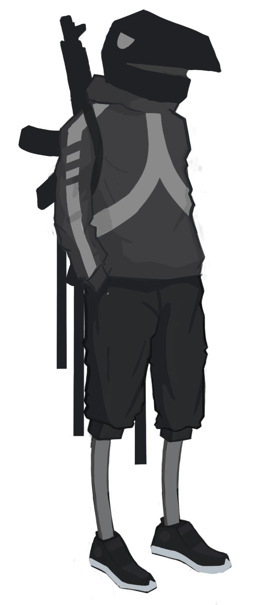

# CORVO

#### DESCRIPTION
An all around character, with average speed, damage and health.
Corvo is good at disengaging with his dash but can also output a lot of damage if he hits his grenade.

Stats                           | 
--------------------------------|-------
Type                            | DPS
Health                          | 100
Speed                           | 7
Charge Rate - Damage Dealt      | 60%
Charge Rate - Damage Received   | 30%

#### WEAPON (Mouse 1)
Corvo has an assault rifle with good range, firerate and average damage.

Stats                           | 
--------------------------------|-------
Damage                          | 7
Range                           | TBD
Firerate                        | 310
Bullet Speed                    | 35

#### ABILITIES

##### Grenade (Mouse 2)
Throw a grenade with AoE damage

Stats                           | 
--------------------------------|-------
Cooldown                        | 6
Damage                          | 30
Cast Range                      | 6
Explosion Range                 | 2
Explosion Timer                 | 2

##### Dash (Shift)
Dash in the direction of the mouse and turn invincible

Stats                           | 
--------------------------------|-------
Cooldown                        | 6
Speed                           | 13
Duration                        | 0.5
Range (Speed x Duration)        | 6.5

### ULTIMATE
##### Boost (Q)
Boost corvo's damage and damage reduction

Stats                           | 
--------------------------------|-------
Damage                          | 50%
Damage Reduction                | 50%
Duration                        | 4